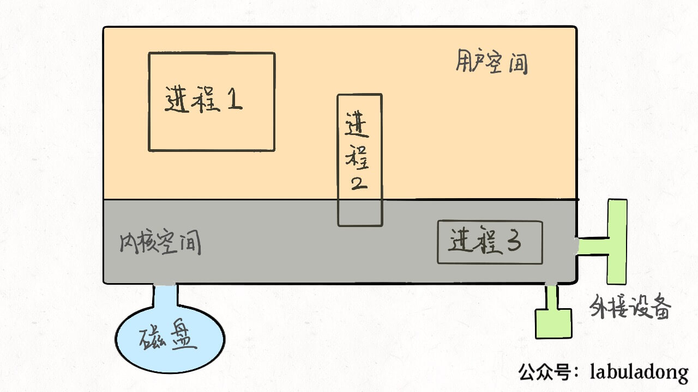

# lubuladong算法小抄

本人主要以[lubuladong算法小抄](https://labuladong.github.io/ebook/)为学习资料。

## 第零章 必读系列

#### 1. 学习算法和刷题的框架思维

1. 数据结构的存储方式：数组（顺序存储）和链表（链式存储）

   > 【多样化的数据结构，究其源头都是在链表或者数组上的特殊操作，API不同而已】
   >
   > - **队列、栈：**数组实现，考虑扩容缩容的问题；链表实现，需要更多内存
   > - **图：**邻接表——链表；邻接矩阵——二维数组
   > - **散列表：**通过散列函数把键映射到一个大数组里，
   > - **树：**堆（完全二叉树）——数组；常见树（二叉搜索树、AVL树、红黑树、区间树、B树）——链表

2. 数组结构的基本操作：遍历+访问，增删查改

   > 【各种数据结构的遍历+访问：线性的(`for/while`) & 非线性的(递归)】 
   >
   > - 数组遍历：典型的线性迭代结构
   > - 链表遍历：兼具迭代和递归结构
   > - 二叉树遍历：典型的非线性递归遍历结构

3. 算法刷题指南

   > 【数据结构是工具，算法是通过合适的工具解决特定问题的方法】
   >
   > - 先刷二叉树
   >
   >   ```c++
   >   void traverse(TreeNode root) {
   >       // 前序遍历
   >       traverse(root.left)
   >       // 中序遍历
   >       traverse(root.right)
   >       // 后序遍历
   >   }
   >   ```

#### 2. 动态规划

【计算机解决问题没有任何奇技淫巧，它唯一的解决办法就是穷举，穷举所有可能性。算法设计无非就是先思考“如何穷举”，然后再追求“如何聪明的穷举”。】

1. **动态规划问题：**其一般形式就是求最值。动态规划其实是运筹学的一种最优化方法。如最长递增子序列、最小编辑距离。

2. **求解动态规划：**核心问题是穷举

   > - 存在**重叠子问题**：暴力穷举的话效率低，所以需要**备忘录**、**DP table**来优化穷举过程，避免不必要的计算。
   >
   > - 具备**最优子结构**：才能通过子问题的最值得到原问题的最值。
   >
   >   > - 最优子结构是某些问题的一种特定性质，并不是动态规划问题专有的。
   >   >
   >   > - Example
   >   >
   >   >   > - 假设你们学校有 10 个班，你已经计算出了每个班的最高考试成绩。那么现在我要求你计算全校最高的成绩，你会不会算？当然会，而且你不用重新遍历全校学生的分数进行比较，而是只要在这 10 个最高成绩中取最大的就是全校的最高成绩。
   >   >   > - 假设你们学校有 10 个班，你已知每个班的最大分数差（最高分和最低分的差值）。那么现在我让你计算全校学生中的最大分数差，你会不会算？可以想办法算，但是肯定不能通过已知的这 10 个班的最大分数差推到出来。——>改造问题最高分数、最低分数。
   >   >
   >   > - 最优子结构作为动态规划问题的必要条件，一定是让你求最值的。
   >
   > - 正确的**状态转移方程**：才能正确的穷举。
   >
   > ```python
   > # 初始化 base case
   > dp[0][0][...] = base
   > # 进行状态转移
   > for 状态1 in 状态1的所有取值：
   > 	for 状态2 in 状态2的所有取值：
   >     	for ...
   >         	dp[状态1][状态2][...] = 求最值(选择1，选择2)
   > ```
   >
   > - dp数组的遍历方向
   >
   >   > - 遍历的过程中，所需的状态必须是已经计算出来的。
   >   > - 遍历的终点必须是存储结果的那个位置。

3. **Example**

   > - 斐波那契数列
   >
   >   > - 暴力递归：完整的递归树，大量冗余。
   >   > - 带备忘录的递归解法：把一颗存在巨量冗余的递归树通过**剪枝**，改造成了一幅不存在冗余的递归图，极大减少了子问题的个数。【**自顶而下**】
   >   > - dp数组的迭代解法：将**备忘录**独立出来成为一张表，叫做DP table，在这张表上完成**自底向上**的推算。
   >   
   > - 凑零钱
   >
   >   ```python
   >   # 伪码框架
   >   def coinChange(coins: List[int], amount:int):
   >       # 定义：要凑出金额n，至少要dp(n)个硬币
   >       def dp(n):
   >           for coin in coins:
   >               res = min(res, 1 + dp(n-coin))
   >           return res
   >       # 题目要求的最终结果是dp(amount)
   >       return dp(amount)
   >   ```
   >
   >   如何列出正确的状态转移方程：
   >
   >   > - 确定base case，显然`amount = 0`时算法返回0
   >   > - 确定状态，也就是原问题和子问题中变化的变量。由于硬币数量无限，面值也是题目给定的，只有amount向base case靠近。
   >   > - 确定选择，也就是导致状态产生变化的行为。目标金额为什么变化呢，因为你在选择硬币，每选择一枚硬币，就相当于减少了目标金额。所以所有硬币的面值，就是你的选择。
   >   > - 明确dp函数/数组的定义。

#### 3. 回溯算法

1. 解决一个回溯问题，实际上就是一个**决策树的遍历过程**。思考三个问题：

   > - 路径：也就是已经做出的选择。
   > - 选择链表：也就是你当前可以做的选择。
   > - 结束条件：也就是到达决策树底层，无法再做选择的条件。
   >
   > ```python
   > result = []
   > def backtrack(路径, 选择列表):
   >     if 满足结束条件:
   >         result.add[路径]
   >         return
   >     for 选择 in 选择列表:
   >         做选择
   >         backtrack(路径,选择列表)
   >         撤销选择
   > ```

2. 全排列问题

   > ```mermaid
   > graph TB
   > id1(( )) --1--> id2(( ))
   > id1(( )) --2--> id3(( ))
   > id1(( )) --3--> id4(( ))
   > 
   > id2(( )) --2--> id5(( ))
   > id2(( )) --3--> id6(( ))
   > id5(( )) --3--> id14(( ))
   > id6(( )) --2--> id7(( ))
   > 
   > id3(( )) --1--> id8(( ))
   > id3(( )) --3--> id9(( ))
   > id8(( )) --3--> id10(( ))
   > id9(( )) --1--> id15(( ))
   > 
   > 
   > id4(( )) --1--> id11(( ))
   > id4(( )) --2--> id12(( ))
   > id11(( )) --2--> id13(( ))
   > id12(( )) --1--> id16(( ))
   > 
   > ```

3. N皇后问题

   ```tex
   给你一个 N×N 的棋盘，让你放置 N 个皇后，使得它们不能互相攻击。
   PS：皇后可以攻击同一行、同一列、左上左下右上右下四个方向的任意单位
   ```

4. 回溯算法 & 动态规划

   > - 回溯算法：路径、选择列表、结束条件
   > - 动态规划：状态、选择、base case
   >
   > 某种程度上说，动态规划的暴力求解阶段就是回溯算法。只是有的问题具有重叠子问题性质，可以用dp table或者备忘录优化，将递归树大幅剪枝，这就变成了动态规划。

#### 4. BFS算法

- BFS：Breadth First Search
- DFS：Depth First Search

1. 常见场景：在一幅图中找到起点`start`到终点`target`的最近距离。

2. 框架

```c
//计算从起点start到终点target的最近距离
int BFS(Node start, Node target) {
    Queue<Node> q; //核心数据结构
    Set<Node> visited; //避免走回头路,大部分情况是必须的，但是想一般的二叉树结构，没有子结点到父节点的指针，不会走回头路就不需要visited
    
    q.offer(start); //将起点加入队列
    visited.add(start);
    int step=0; //记录扩散的步数
    
    while (q not empty) {
        int sz = q.size();
        /* 将当前队列中的所有结点向四周扩散 */
        for (int i = 0; i < sz; i++) {
            Node cur = q.poll();
            /* 划重点：这里判断是否到达终点*/
            if (cur is targer)
                return step;
            /* 将cur的相邻结点加入队列 */
            for (Node x: cur.adj())
                if (x not in visited) {
                    q.offer(x);
                    visited.add(x)
                }
        }
        step++;
    }
}
```

3. Example

   > - 111 二叉树的最小高度
   > - 752 解开密码锁的最少次数

4. 双向BFS优化

   > - 传统BFS：从起点开始向四周扩散，遇到终点时停止
   >
   > - 双向BFS：从起点和终点同时开始扩散，当两边有交集的时候停止
   >
   >   > 局限：必须知道终点在哪里？
   >   >
   >   > 优化：在while循环开始时做一个判断：
   >   >
   >   > ```java
   >   > // ...
   >   > while (!q1.isEmpty() && !q2.isEmpty()) {
   >   >     if (q1.size() > q2.size()) {
   >   >         // 交换 q1 和 q2
   >   >         temp = q1;
   >   >         q1 = q2;
   >   >         q2 = temp;
   >   >     }
   >   >     // ...
   >   > ```

#### 5. 二分查找

- 框架

  【while的判断条件（根据搜索区间的开闭）、指针的改变、找到target的动作】

  ```c++
  //细节：mid是否+1？while中使用<=? <?
  int binarySearch(int[] nums, int target) {
      int left = 0, right = ...;
      
      while(...) {
          int mid = left + (right-left) / 2;
          if (nums[mid] == targer) {
              ...;
          } else if (nums[mid] < target) {
              left = ...;
          } else if (nums[mid] < target) {
              right = ...;
          }
      }
      return ...;
  }
  ```

- 常见场景

  > - 寻找一个数
  > - 寻找左侧边界
  > - 寻找右侧边界

#### 6. 滑动窗口

- 算法逻辑

  > - 增大窗口：更新窗口内的信息，判断是否要收缩窗口
  > - 收缩窗口：更新窗口内的信息，判断是否得到答案
  >
  > ```c
  > int left = 0, right = 0;
  > while(right<s.size()) {
  >     //增大窗口
  >     window.add(s[right]);
  >     right++;
  >     
  >     while(window need shrink) {
  >         //缩小窗口
  >         window.remove(s[left]);
  >         left++
  > ```
- 算法框架

  ```c
  void slidingWindow(string s, string t) {
      unordered_map<char, int> need, window;
      for (char c : t) need[c]++;
      
      int left = 0, right = 0;
      int valid = 0;
      while (right < s.size()) {
          // c 是将移入窗口的字符
          char c = s[right];
          // 右移窗口
          right++;
          // 进行窗口内数据的一系列更新
          ···
              
          /*** debug 输出的位置***/
          printf("window: [%d, %d])\n", left, right);
          /*******************/
          
          //判读左侧窗口是否要收缩
          while (window needs shrink) {
              // d 是将移出窗口的字符
              char d = s[left];
              // 左移窗口
              left++;
              // 进行窗口内数据的以系列更新
              ···
          }
      }
  }
  ```


#### 7. 双指针技巧

1. 快慢指针：主要解决链表中的问题，如链表中是否有环

   【快慢指针一般都初始化指向链表的头结点 head，前进时快指针 fast 在前，慢指针 slow 在后，巧妙解决一些链表中的问题。】

   > - 判定链表是否有环
   >
   > - 已知链表中有环，返回这个环的起始位置
   >
   >   
   >
   >   
   >
   >   
   >
   > - 寻找链表的中点（用来对链表进行归并排序）
   >
   >   
   >
   > - 寻找链表的倒数第k个元素

2. 左右指针：主要解决数组（字符串）中的问题，如二分查找

   【左右指针在数组中实际是指两个索引值，一般初始化为`left=0, right = nums.length-1`】

   > - 二分查找
   > - 两数之和
   > - 反转数组
   > - 滑动窗口算法

#### 8. Linux的进程、线程、文件描述符

1. Linux进程

   > 
   >
   > ```c
   > struct task_struct{
   >     // 进程状态
   >     long state;
   >     // 虚拟内存结构体
   >     struct mm_struct *mm;
   >     // 进程号
   >     pid_t pid;
   >     // 指向父进程的指针
   >     struct task_struct __rcu *parent;
   >     // 子进程列表
   >     struct list_head children;
   >     // 存放文件系统信息的指针
   >     struct fs_struct *fs;
   >     // 一个数组，包含该进程打开的文件指针
   >     struct files_struct *files;
   > };
   > ```

2. 文件描述符

   > 
   >
   > `file[0],file[1],file[2]:`填入默认值，分别指向标准输入流、标准输出流、标准错误流。
   >
   > - 重定向：修改`file[0],file[1],file[2]`的指向。
   > - 管道符：将一个进程的输出流和另一个进程的输入流接起一条管道。

3. 线程

   > 
   >
   > 
   >
   > - 系统调用：`fork(): 创建以一个子进程，pthread():创建一个线程`
   > - Linux中进程线程没有区别：都是用`task_struct`结构表示，**唯一的区别就是共享的数据区域不同**
   > - 在 Linux 中新建线程和进程的效率都是很高的，对于新建进程时内存区域拷贝的问题，Linux 采用了 **copy-on-write** 的策略优化，也就是并不真正复制父进程的内存空间，而是等到需要写操作时才去复制。

## 第一章 动态规划设计

#### 1. 最长递增子序列（LIS）

0. 设计动态规划的通用技巧：**数学归纳思想**：寻找正确的状态转移方程。
1. 明确 dp 数组所存数据的含义。
2. 根据 dp 数组的定义，运用数学归纳法的思想，假设 dp[0...i-1] 都已知，想办法求出dp[i]
(若无法完成，可能就是dp数组的定义不够恰当；或者可能dp数组存储的信息还不够，不足以退出下一步的答案，需要把dp数组扩大成二维数组甚至三维数组。)

【Longest Increasing Subsequence】

> ```
> 题目：
>     给定一个无序的整数数组，找到其中最长上升子序列的长度。
> 示例：
>     输入：[10, 9, 2, 5, 3, 7, 101, 18]
>     输出：4
>     解释：最长的上升子序列是[2, 3, 7, 101],其长度为4
> ```
>
> - dp[i]表示以nums[i]这个数结尾的最长递增子序列的长度。
> - base case: dp[i]初始值为1，因为以nums[i]结尾的最长递增子序列起码要包含它自己。
> - 最终结果：应该是dp数组中的最大值。

#### 2. 最大子数组

- ```
  53. 最大子序和
      给定一个整数数组 nums ，找到一个具有最大和的连续子数组（子数组最少包含一个元素），返回其最大和。
  示例:
      输入: [-2,1,-3,4,-1,2,1,-5,4]
      输出: 6
      解释: 连续子数组 [4,-1,2,1] 的和最大，为 6。
  ```

- 思路分析

  > - 滑动窗口算法：不可，因为数组中数字可以是负数，导致无法确定什么时机去收缩左侧窗口。
  >
  > - 动态规划
  >
  >   > - `dp[i]: nums[0…i]`中的最大的子数组和。不可，因为子数组一定是连续的，按照我们当前dp数组定义，并不能保证`nums[0…i]`中的最大子数组与`nums[i+1]`是相邻的，也就没办法从`dp[i]` 推导出`dp[i+1]`。
  >   > - **重新定义`dp[i]:`以`nums[i]`为结尾的最大子数组和**。（要得到整个`nums[]`数组的最大子数组和，需遍历整个dp[i]获得最大值）

#### 3. 背包问题

1. ##### 0-1背包问题

   > - **描述：**给你一个可装载重量为 `W` 的背包和 `N` 个物品，每个物品有重量和价值两个属性。其中第 `i` 个物品的重量为 `wt[i]`，价值为 `val[i]`，现在让你用这个背包装物品，最多能装的价值是多少？
   >
   > - **状态和选择：**背包的容量 & 可选择的物品；装进背包&不装进背包
   >
   > - **明确dp数组的定义：**对于前`i`个物品，当前背包的容量为`w`，这种情况下可以装的最大价值是`dp[i][w]`
   >
   > - **根据选择，思考状态转移的逻辑：**
   >
   >   > - 没有把第i个物品装入背包：`dp[i][w] =  dp[i-1][w]`
   >   > - 把第i个物品装入背包：`dp[i][w] = dp[i-1][w-wt[i-1]] + val[i-1]`

2. ##### 完全背包问题（物品无限）

   > - **描述：**给定不同面额的硬币和一个总金额。写出函数来计算可以凑成总金额的硬币组合数。假设每一种面额的硬币有无限个。
   >
   > - **转化为背包问题的描述形式：**有一个背包，最大容量为amount，有一系列物品`coins`，每个物品的重量为`coins[i]`，每个物品的数量无限，请问有多少种方法，能够恰好把背包装满？
   >
   > - **状态和选择：**背包的容量（amount） & 可选择的物品（coins）；装进背包&不装进背包
   >
   > - **明确dp数组的定义：**若只使用前`i`个物品，当背包容量为`j`时，有`dp[i][j]`种方法可以装满背包。
   >
   > - **思考状态转移逻辑：**
   >
   >   > - 没把第i个物品装入背包：`dp[i][j] = dp[i - 1][j]`
   >   > - 把第i个物品装入背包：`dp[i][j] = dp[i - 1][j] + dp[i][j - coins[i - 1]]`， 加入i或者不加i两种选择的结构之和。
   
3. ##### 子集分割

   > - **描述：**给定一个只包含正整数的非空数组。是否可以将这个数组分割成两个子集，使得两个子集的元素和相等。
   >
   > - **转化为背包问题：**给你一个可以装载重量为`sum/2`的背包和N个物品，每个物品的重量为nums[i]。现在让你装物品，是否存在一种装法，能够恰好将背包装满
   >
   > - **状态和选择：**背包的容量（amount） & 可选择的物品（coins）；装进背包&不装进背包
   >
   > - **明确dp数组的定义：**`dp[i][j] = x`，对于前i个物品，当前背包的容量为j时，若x为True，则说明恰好可以将背包装满，若x为false，则说明不能恰好将背包装满。
   >
   > - **思考状态转移逻辑：**
   >
   >   > - 没把第i个物品装入背包：`dp[i][j] = dp[i - 1][j]`
   >   > - 把第i个物品装入背包：`dp[i][j] = dp[i][j - nums[i - 1]]`， 加入i或者不加i两种选择的结构之和。
